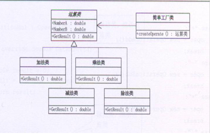

# 简单工厂模式
===============

- 主要用于创建对象；
- 新添加类，不会影响以前系统的代码；
- 核心思想是用一个工厂来根据输入的条件产生不同的类，然后根据不同的类的virtual 函数得到不同的结果；
GOOD：适用于不同情况创建不同的类时；
BUG：客户端必须知道基类和工厂类，耦合性差；

1. 基类存放数据、结果的接口；
2. 派生类存放操作
3. 实现接口类，用静态函数实现调用各种派生类

